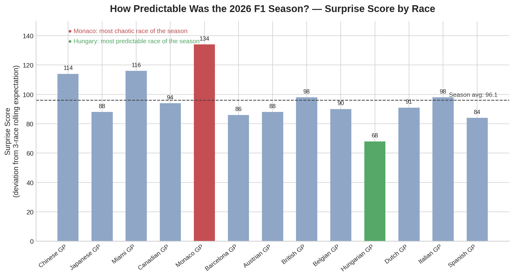

# F1 Surprise Score Tracker

**How predictable was the 2026 Formula 1 season, really?**

A season-long analysis that scores every Grand Prix on how much the actual result deviated from what was expected — not a race predictor, but a running measure of chaos vs. predictability across an F1 season.

## The idea

Most F1 "prediction" projects try to guess the next race and stop there. This project asks a different question: **across a full season, which races actually surprised us, and which didn't?**

Before each race, three expectations are set:
- **Model** — a simple form-based prediction (recent quali position + rolling recent-race performance)
- **Head** — a rational, informed personal prediction
- **Heart** — a fandom-driven prediction (who I'm rooting for, regardless of form)

After the race, actual results are compared against a **3-race rolling average expectation**, and the deviation is converted into a single per-race **Surprise Score**. A high score means the race defied recent form; a low score means it played out roughly as expected.

## Key findings (13 races tracked, 2026 season)

- **Season average Surprise Score: 96.1**
- **Monaco GP was the most chaotic race of the season (134)** — the biggest deviation from the rolling-form baseline of any race tracked
- **Hungarian GP was the most predictable (68)** — the result matched recent form more closely than any other race
- No clear upward or downward trend across the season — predictability varies race to race rather than the season getting more or less chaotic over time
- Full per-race breakdown in [`season_surprise_scores.csv`](season_surprise_scores.csv)

## How it's built

1. **Data collection** — [FastF1](https://github.com/theOehrly/Fast-F1) pulls qualifying results and race results for each completed round of the 2026 season
2. **Form baseline** — a 3-race rolling average per driver (qualifying position + recent race performance) sets the "expected" outcome going into each race
3. **Surprise Score** — actual finishing positions are compared against that rolling expectation; deviations are summed per race into one Surprise Score
4. **Automation** — `season_surprise_scores.py` loops through the FastF1 event schedule automatically, skipping cancelled rounds, and appends each completed race to `season_surprise_scores.csv`
5. **Dashboard** — Power BI, built directly on the CSV output

## Tech stack

Python · FastF1 · pandas · Power BI

## Known limitations

- The rolling baseline needs 3 prior races to stabilize, so the first two rounds of the season aren't included in the scoring
- Surprise Score is a relative measure (deviation from recent form), not an absolute measure of race quality or excitement — a "predictable" race can still be a great race
- iOS/mobile export of the Power BI dashboard isn't available (Power BI's web publish requires a work/school email); the chart above is exported as a static image for that reason

## What's next

- Add fan sentiment data (r/formula1 post-race threads, VADER sentiment) to see whether fan reaction to a race correlates with its Surprise Score
- Use FastF1 telemetry to explain *why* the biggest surprise of each race happened (e.g. a crash, a strategy call, a weather shift)

---
Repo: https://github.com/geraldtomy/f1-prediction-tracker
